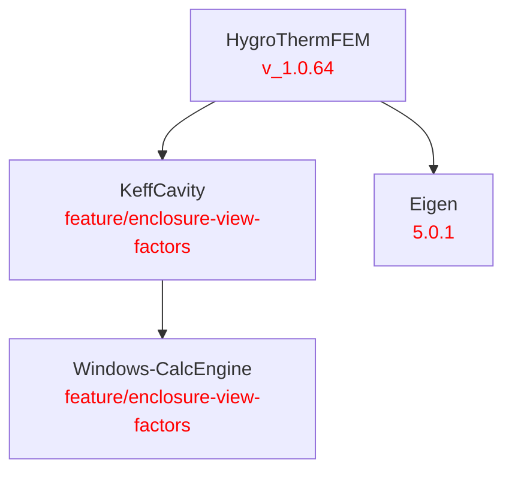

```mermaid
graph TD
    %% Package definitions
    HygroThermFEM[HygroThermFEM<br/><font color='red'>v_1.0.64</font>]
    KeffCavity[KeffCavity<br/><font color='red'>feature/enclosure-view-factors</font>]
    Eigen[Eigen<br/><font color='red'>5.0.1</font>]
    WindowsCalcEngine[Windows-CalcEngine<br/><font color='red'>feature/enclosure-view-factors</font>]

    %% Package relations
    HygroThermFEM --> KeffCavity
    HygroThermFEM --> Eigen
    KeffCavity --> WindowsCalcEngine
```
